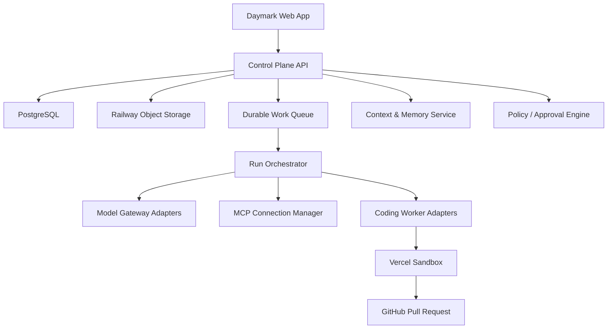
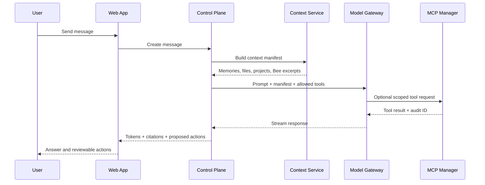
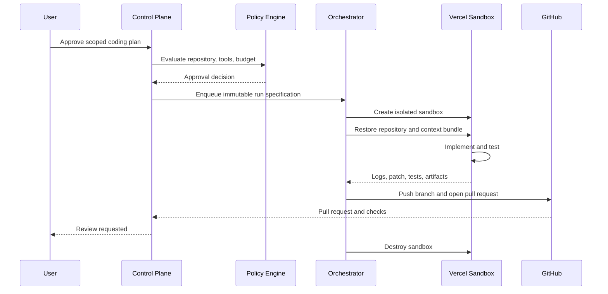
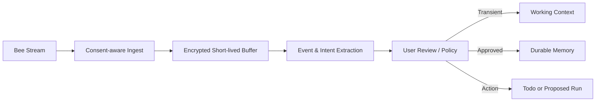

# Architecture and Data Flows

## System overview

## Component responsibilities

| Component | Owns | Must not own |
| --- | --- | --- |
| Web app | presentation, optimistic UI, streaming display | provider secrets or authority |
| Control Plane API | auth, tenancy, domain commands, aggregate reads | arbitrary code execution |
| PostgreSQL | authoritative structured state and audit metadata | large binary artifacts |
| Object storage | project files, run artifacts, snapshots, exports | mutable task state |
| Context service | retrieval, provenance, memory policy | direct side effects |
| Policy engine | scopes, approvals, budgets, risk classification | model reasoning |
| Queue | durable, retryable work dispatch | final business state |
| Orchestrator | run state machine and adapter coordination | user identity source |
| Model adapters | normalized inference and tool-call envelopes | direct database access |
| MCP manager | connection scopes, tool discovery, invocation records | self-approved scopes |
| Worker adapters | worker-specific task translation | durable project authority |
| Vercel Sandbox | isolated coding compute | durable user data or credentials |

## Assistant chat flow

Normal conversation never starts a sandbox.

## Coding change flow

## Bee live-context flow

Bee context is opt-in per conversation. Raw streams should be short-lived.

## Memory lifecycle

1. Ingest a candidate with source, timestamp, actor, and consent state.
2. Classify it as transient context, proposed memory, or explicit user memory.
3. Deduplicate against semantically similar active memories.
4. Ask for confirmation when the item is sensitive, ambiguous, or behavioral.
5. Store approved durable memory with provenance and retention policy.
6. Retrieve through a context manifest that records why each item was selected.
7. Support correction, supersession, archival, export, and deletion.

## Deployment topology

Recommended initial topology:

- Web app on Vercel or Railway.
- Control plane, queue workers, and scheduled jobs on Railway.
- Managed PostgreSQL with row-level tenant enforcement.
- Railway object storage for project files and artifacts.
- Vercel Sandbox as ephemeral coding compute.
- GitHub App for repository access and pull-request delivery.
- Monroe Eve-compatible events for durable schedules and notifications.

Keep interfaces portable; deployment location is an adapter decision.
