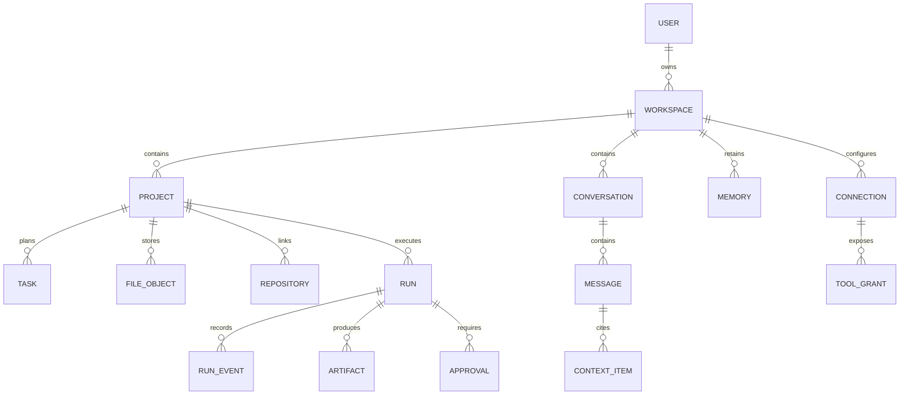

# Domain Data Model

## Relationship map

## Core records

### Workspace

Tenant and policy boundary. Contains timezone, locale, default model routes,
retention policies, budget policy, and enabled features.

### Project

Stable home for a goal across conversations and repositories. Important fields:
`id`, `workspace_id`, `name`, `status`, `summary`, `current_phase`,
`next_milestone`, `risk_state`, and `version`.

### Task

Structured intent. Use `kind` to distinguish personal, planning, research,
communication, and coding work. A coding task is not itself permission to run.

### Conversation and Message

Conversation carries a selected project, model route, MCP grant set, Bee consent
state, and retention mode. Every assistant message points to the exact context
manifest and provider request that produced it.

### Memory

Recommended fields:

- `type`: fact, preference, decision, commitment, relationship, procedure;
- `scope`: personal, workspace, project, conversation;
- `content` and optional structured `value`;
- `source_type` and `source_id`;
- `confidence`, `sensitivity`, and `retention_policy`;
- `valid_from`, `valid_to`, `supersedes_id`;
- `embedding_ref` rather than the embedding as domain truth.

### FileObject

Metadata record for bytes in object storage. Include content hash, media type,
size, project, producing actor/run, storage key, scan state, and version.

### Run

Immutable execution request plus mutable lifecycle state. Recommended states:

`proposed → planning → awaiting_approval → queued → provisioning → running →
testing → publishing_pr → awaiting_review → completed`

Terminal alternatives: `cancelled`, `failed`, `expired`.

### Approval

Captures who approved which immutable plan hash, at what risk level, for which
resources, until what expiry. Any material scope change invalidates approval.

### RunEvent

Append-only event carrying sequence, timestamp, actor, event type, payload
reference, and trace identifiers.

### Connection and ToolGrant

Connection stores provider metadata and secret references. ToolGrant controls
which surface, agent, project, and action class may invoke a discovered MCP
tool.

## Concurrency and integrity

- Use UUIDv7 or another sortable unique identifier.
- Include `workspace_id` on every tenant-owned row.
- Use optimistic versions for user-edited project state.
- Enforce idempotency keys on commands and provider callbacks.
- Store large prompts, logs, and artifacts in object storage with hashes.
- Use an outbox table so domain commits and queued events cannot diverge.
- Never infer approval from UI state; verify an active approval record.
